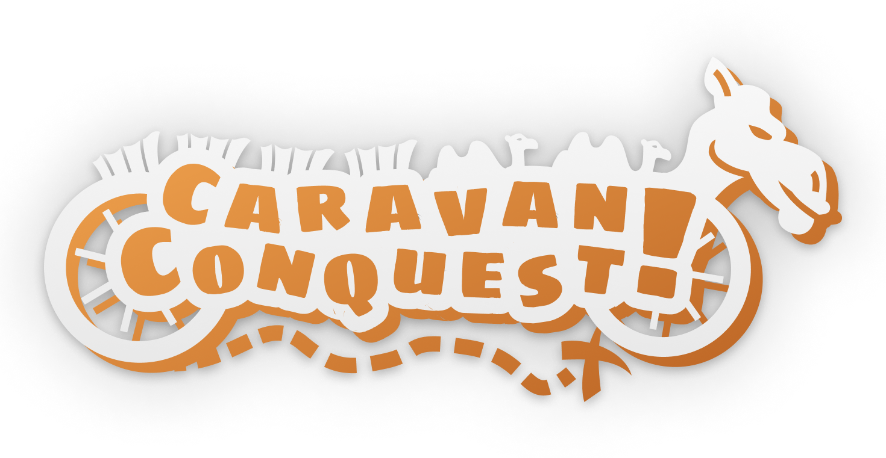

In Caravan Conquest, players embark on an adventurous journey across a vibrant,
tile-based map filled with diverse terrains and hidden treasures. Each player
controls a caravan that carries valuable goods and gold, racing against opponents
to reach a designated destination first. Along the way, players will encounter
various challenges and opportunities, such as trading posts, ambushes from bandits,
and mystical events that can either bolster their resources or deplete them.

As players traverse the map, they must strategically manage their inventory of goods,
balancing the need for speed with the desire to collect as many valuable items
as possible. The game features a dynamic trading system where players can exchange
goods for gold at specific locations, with the value of goods diminishing for those
who arrive after the first player reaches the goal. This creates a sense of urgency
and competition, compelling players to make tactical decisions about when to trade
and when to press forward.

The game includes elements of resource management, where players can upgrade their
caravans to enhance capacity or speed, making each turn crucial for long-term strategy.
The rich interactions and varying encounters ensure that no two games are alike,
promoting replayability and strategic depth.
