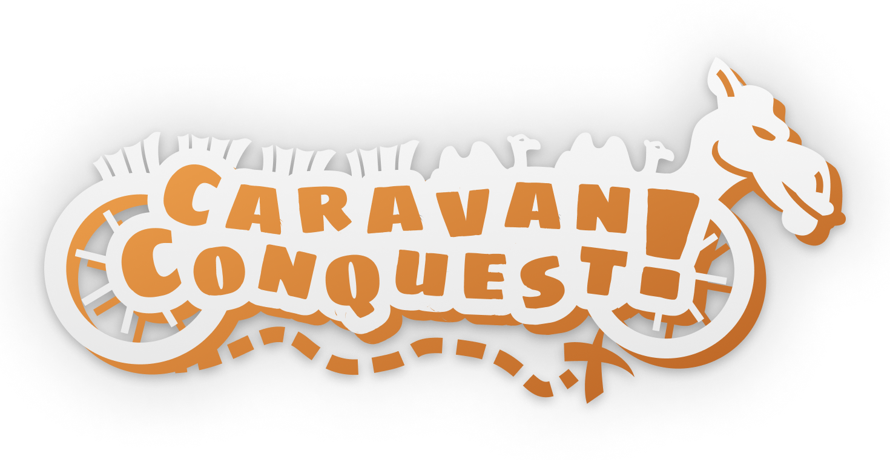
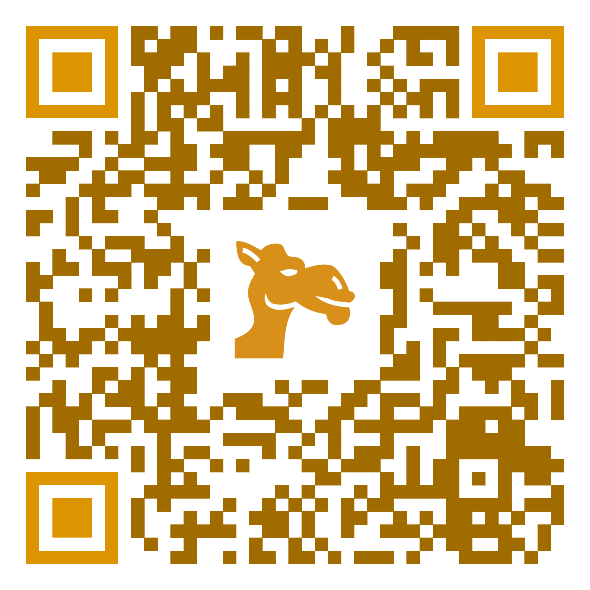

\

# Caravan Conquest - Rules

## Objective

Be the first player to reach the Finish with the most valuable goods,
equipment and gold.

## Game Setup

1. Create the map from the provided tiles, by placing them in a grid,
   so that the Finish tile can be reached from the Start tile.
     - You can experiment with different map layouts and make every game unique!
2. Place the treasure on some of the reachable tiles of the map.
3. Give each player a basic pair of draft animals and a caravan.
   Also give each player some starting amount of resources and gold.
    - The recommended starting gear is:
      - *Basic Caravan*
      - 2x *Donkey*
      - 10 *Gold*
      - 10 *Spice*conquest
      - 5 *Silk*

      However, you can try experimenting with these, too!

## Gameplay

1. **Turn order:** Players take turns in clockwise order.

2. **Movement:**

    - On your turn, you can move your caravan each step to one of
      the 4 neighboring tiles, unless it's a River
      (see [Tile Types and Effects](#tile-types-and-effects)). You cannot
      end up on the same tile you started your turn from.

    - The amount of steps you can make, or your **Total Movement Speed**,
      depends on your **Base Speed**, tile effects, and current load.

    - Your **Base Speed** is equal to the minimum speed of both of your draft
      animal's speeds.

    - Your **Total Speed** is decreased by 1 if you are carrying load over your
      carrying capacity. Your speed further decreases by 1 for every 10 units over
      the capacity.

    *Example: Your caravan has the capacity of 120 units.
              One of your horses has 5 speed and the other has 4 speed.
              Your **Base Speed** is then 4. However, you begin your turn on a desert
              tile, so your total speed is decreased by 1. Furthermore, your current
              load is 125, 5 units over your carrying capacity, further decreasing your
              speed by 1. Therefore, your **Total Movement Speed** is 2.*

3. **Tile Encounters:**

    - You interact with a tile only when you end your turn on it,
      not when you are moving through.

    - On the end of your turn, draw an encounter card (see next section
      **Special encounters**)

    - Trade Camps: Trade goods for gold, or vice-versa.

    - Cities: Buy or sell equipment with gold
      (see [Resource and Caravan Management](#resource-and-caravan-management)).

4. **Special encounters:**

    - Draw an encounter card corresponding to the tile type you are standing on
      at the end of your turn.

    - Special encounter cards are not drawn on **City** and **Trade Camp**.

    - If the encounter tells you to give up more resources than you currently have,
      give up only as much, as you have.

5. **Treasure:** Collect the treasure. Treasure is a special resource
                 that cannot be traded during the game, but weighs only 1 unit
                 and is worth 40 gold.

## Tile Types and Effects

Each tile type has its own effect and special encounters.

Consult the Legend sheet for regular tile effects that apply every time.
Some tiles can even affect your movement speed on the next turn, so read closely!

There are decks of cards containing special encounters for different tile types.
You draw from one of these decks at the end of your turn, depending on which tile
you are on. The encounter card takes effect immediately, unless
the card itself specifies otherwise.

## Trading

There are two types of Trade camps:

1. Silk - in this Trade camp, you can trade 1 silk for 10 gold.
2. Spice - in this Trade camp, you can trade 1 spice for 5 gold.

## Resource and Caravan Management

- Upgrade your caravan to increase your carrying capacity.
- You can buy better draft animals to increase your movement speed and gain
  special improvements.
- Once owned, any equipment or animal's worth becomes the half of its original price[^1].
  You can sell the equipment for this price in gold[^2].

[^1]: In case the half is not a whole number, it is rounded down.
[^2]: You must always have exactly two draft animals and one caravan.

## Winning the Game

- The game ends when all players reach the Finish tile, or after 10 turns have passed
  since the first player has finished.
- After the first player reaches the Finish:
  - The  value of each resource decreases by 1 each turn
  - A countdown starts: 10 turns are left until the game ends
- **End of the Game:**
  - Players who have not reached the Finish tile automatically lose, with their
    total wealth being zero.
  - Count your goods and gold; the player with highest total wealth wins!

## The Travelling Merchant's Ledger

- U can use the web app located at
  [https://sevcak.github.io/caravan-conquest-boardgame/](https://sevcak.github.io/caravan-conquest-boardgame/) to help you track your resources and remaining caravan capacity

{width=40% align="center"}\
